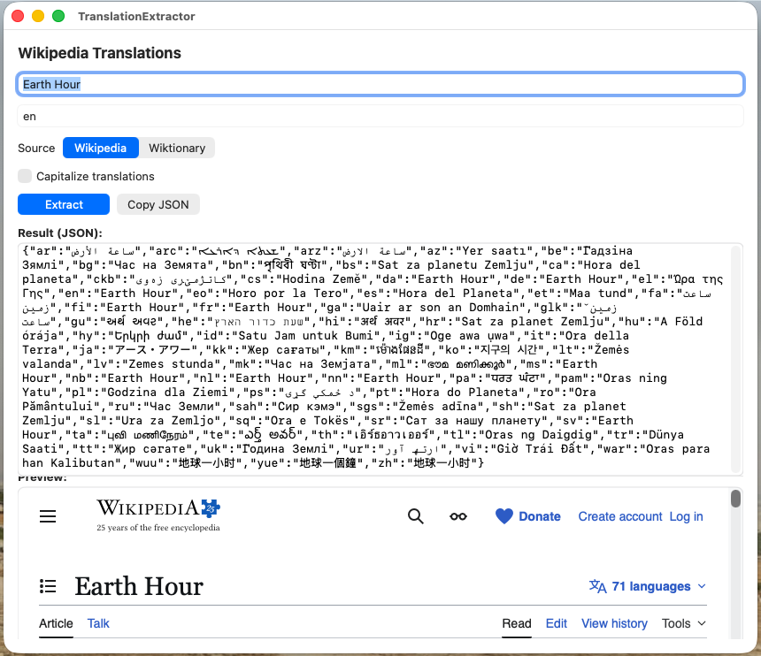

TranslationExtractor is a utility program Aaron Adelman created to help with the localization of event files in Date-O-Rama.  The user can input the name of an event, and TranslationExtractor will attempt to extract localized names from Wikipedia or Wikitionary.  TranslationExtractor was developed largely as an exercise in vibe coding.

TranslationExtractor is probably not useful for you unless you want to work on improving Date-O-Rama.  You may, however, find it useful as an example of how to get localization information out of Wikipedia or Wikitionary programatically.

